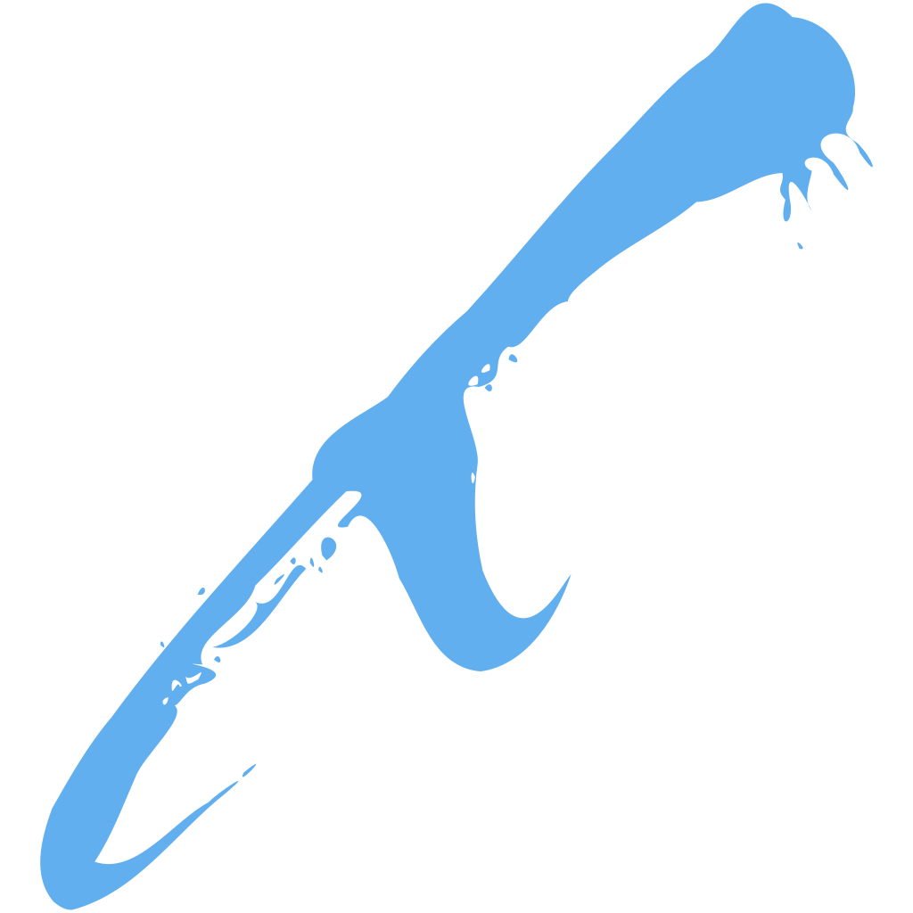
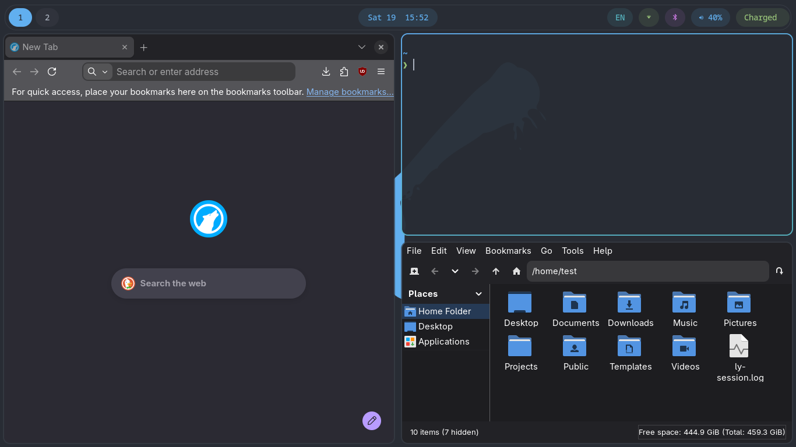

# Sobarch
##### Arch's own principle, finally applied to the desktop.

Sobarch is a Hyprland desktop for Arch Linux: installer, versioned
configuration, and package tooling in one repo. It applies Arch's own
KISS principle to the layer most distributions abandon it at: the
desktop environment itself.

A modern desktop needs a secrets store, a polkit agent, network
management, and a video editor, among other things. Sobarch picks
whichever tool delivers each of those without pulling in a whole
foreign desktop environment's framework to get there: `oo7` instead of
KWallet, `hyprpolkitagent` instead of `polkit-kde-agent`, a
NetworkManager-driven fuzzel menu instead of a GUI applet, Shotcut
instead of Kdenlive. Same capability, a fraction of what actually gets
installed.

Built to run one machine well, kept legible enough that yours can be
the second. Full documentation lives at
[sobarch.antoinepoulin.com](https://sobarch.antoinepoulin.com/docs/).

## Table of Contents

<!-- mtoc-start -->

* [What's included](#whats-included)
* [Software profiles](#software-profiles)
* [Quickstart](#quickstart)
  * [Prebuilt ISO](#prebuilt-iso)
* [Day-to-day use](#day-to-day-use)
* [Documentation](#documentation)
* [Development](#development)
* [License](#license)

<!-- mtoc-end -->

  

## What's included

| | |
| --- | --- |
| **Desktop** | Hyprland, Waybar, Mako, Fuzzel, Kitty, and `ly` as the display manager, with `hyprlock`/`hypridle`/`hyprpaper`/`hyprshot`/`hyprpicker` for locking, idle, wallpapers, and screenshots. GPU driver selection (including NVIDIA generation detection) is automatic. |
| **One theme, everywhere** | Every app config is generated from one base16/base24 color scheme via `tinty`, so switching themes recolors the terminal, bar, launcher, notifications, and editor together. |
| **Shell and editor** | Plain `bash` with `ble.sh` and `starship`, and a from-scratch Neovim config built on Neovim's own `vim.pack`. Both ship by default. |
| **Bootable snapshots** | BTRFS root snapshots (Snapper) appear as boot entries in the Limine menu. A spare Arch ISO on its own partition makes rollback possible even when the system won't boot, with no USB drive needed. |
| **Security baseline** | A default-deny `nftables` firewall and a locked root account out of the box. SSH stays off unless enabled during install. Optional LUKS encryption of the root partition. |
| **Reviewed packages only** | Arch's official repositories plus a small set of AUR packages vendored and reviewed into this repo, built locally by a dedicated build user. No AUR helper, no third-party binary repository. |
| **Flexible installs** | Wipe a disk, or install into free space for dual-boot. Interactive TUI, unattended with an answer file, or over the network with PXE. |

## Software profiles

Optional, applied after first boot, and unchecked by default:

| Profile | Included |
| --- | --- |
| Developer | `mise`, `presenterm` |
| Gaming | Steam, Lutris, Prism Launcher, gamescope, MangoHud, Protontricks, ProtonUp-Qt |
| Creative | GIMP, Inkscape, OBS Studio, Shotcut, Audacity, EasyEffects, Calf, LSP plugins |
| Maker / 3D Printing | Blender, FreeCAD, OrcaSlicer |
| Virtualization | QuickEMU, QuickGUI |
| Office | LibreOffice, Homebank |
| Browsers & Chat | Brave, Signal, Vesktop |
| System Tuning | TLP, LACT, nvtop, smartmontools, ethtool, VIA keyboard support |
| Input Method | fcitx5 (CJK, Hangul) |

Each profile can be expanded to hand-pick individual packages, and "install everything" is a single toggle.

## Quickstart

Boot the [official Arch Linux ISO](https://archlinux.org/download/),
connect to the network (`iwctl` for Wi-Fi; wired works out of the box),
then run:

    curl -fsSL http://installsobarch.antoinepoulin.com | bash

This is the only manually-typed, unbranded step. It fetches this
repository and launches the TUI installer, which walks through disk
selection, account/locale setup, and optional software profiles before
handing off to `archinstall`.

**Note:** by default, the installer partitions and wipes the entire
target disk. It can also install into existing free space instead, for
dual-boot alongside another OS (see the [Dual-Boot
docs](https://sobarch.antoinepoulin.com/docs/installer/dual-boot/)).

For scripted, no-prompts installs, pass `--answer-file` with a JSON
file instead of using the interactive wizard (see the [Unattended
Install
docs](https://sobarch.antoinepoulin.com/docs/installer/unattended-install/)).
Booting that path over the network instead of from a USB drive is also
possible, see the [PXE Netboot
docs](https://sobarch.antoinepoulin.com/docs/installer/pxe-netboot/).

### Prebuilt ISO

A monthly-built ISO with the installer and the
base system's packages pre-cached is published on the [Releases
page](https://github.com/Dwarf1er/sobarch/releases), letting a real
install resolve those packages from local disk instead of downloading
them. Optional software profiles still install over the network at
first boot either way. Boot it the same way as the official ISO;
everything else above still applies. This doesn't replace the
bootstrap command above, which stays the primary, always-current path.

Each release is signed with a project-dedicated key (fingerprint
`9CC2 2D5E C575 F128 628E  A8F6 AFC1 54B3 F842 8676`), whose public key
is [`sobarch-iso-signing.asc`](sobarch-iso-signing.asc) in this repo —
import it once, then verify the same way as the official Arch ISO's own
`.sig` files:

    gpg --import sobarch-iso-signing.asc
    gpg --verify sobarch-YYYY.MM.DD-x86_64.iso.sig sobarch-YYYY.MM.DD-x86_64.iso

GitHub also shows each release asset's own SHA256 digest directly on the
[Releases page](https://github.com/Dwarf1er/sobarch/releases), for a
plain comparison without `gpg`.

## Day-to-day use

No terminal is required for upkeep. Tap `Super` for the Fuzzel main menu,
which covers updating the system, reviewing config merge conflicts,
installing additional packages, switching themes and wallpapers, and
refreshing the rescue ISO.

**Updating.** **Super, Sobarch, Update System** (or `sobarch update` in a
terminal) runs `pacman -Syu`, rebuilds any vendored package that is behind,
and merges config updates into `$HOME` with a three-way merge. Your edits
are never overwritten: a true conflict leaves the new version beside yours
as `<file>.sobarch-new`. A plain `pacman -Syu` still works too.

**Notifications.** A daily check tells you when updates or a newer rescue
ISO are waiting, a failed vendored-package build is reported instead of
failing silently, and booting a snapshot entry shows a persistent prompt
offering to make it your permanent system.

**The `sobarch` command.** A thin front end for the same actions the menus
run:

| Command | What it does |
| --- | --- |
| `sobarch update` | Full system update: official packages, vendored packages, config merge |
| `sobarch review-conflicts` | Walk through leftover `.sobarch-new` conflicts |
| `sobarch aur-sync [PKG...]` | Update installed vendored packages, or build exactly the ones named |
| `sobarch snapshot-restore N` | Make Snapper snapshot `N` the permanent root |
| `sobarch rescue-refresh` | Re-fetch the Arch ISO onto the rescue partition |

## Documentation

The [manual](https://sobarch.antoinepoulin.com/docs/) covers everything above in depth:

* [Getting started](https://sobarch.antoinepoulin.com/docs/getting-started/): installation, first boot, the prebuilt ISO
* [Installer](https://sobarch.antoinepoulin.com/docs/installer/): disks and accounts, encryption, dual-boot, snapshots, rescue media, unattended and PXE installs
* [Desktop](https://sobarch.antoinepoulin.com/docs/desktop/): menus, keybindings, theming, notifications, updating, the `sobarch` command
* [Shell and editor](https://sobarch.antoinepoulin.com/docs/shell-editor/): kitty, bash, starship, Neovim
* [Packages](https://sobarch.antoinepoulin.com/docs/packages/): how AUR and custom packages are vendored, built, and updated
* [Reference](https://sobarch.antoinepoulin.com/docs/reference/): security, files and logs, troubleshooting, FAQ

## Development

After cloning, run `scripts/install-git-hooks.sh` once. It points git at
this repo's tracked `.githooks/` dir, which validates `packages/custom/`
PKGBUILDs before each commit (requires `makepkg` on `PATH`).

## License

This software is licensed under the [MIT license](LICENSE).
